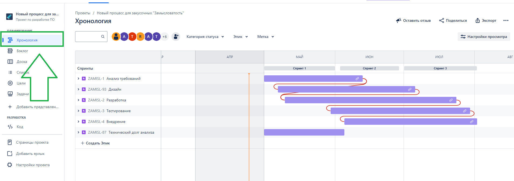
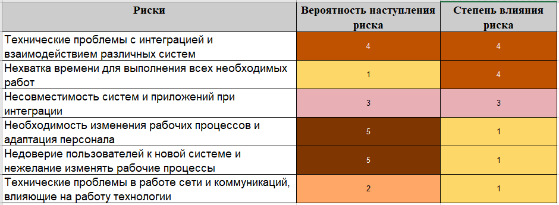
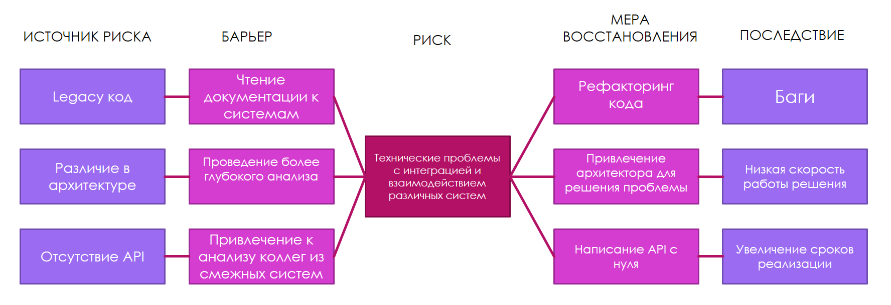
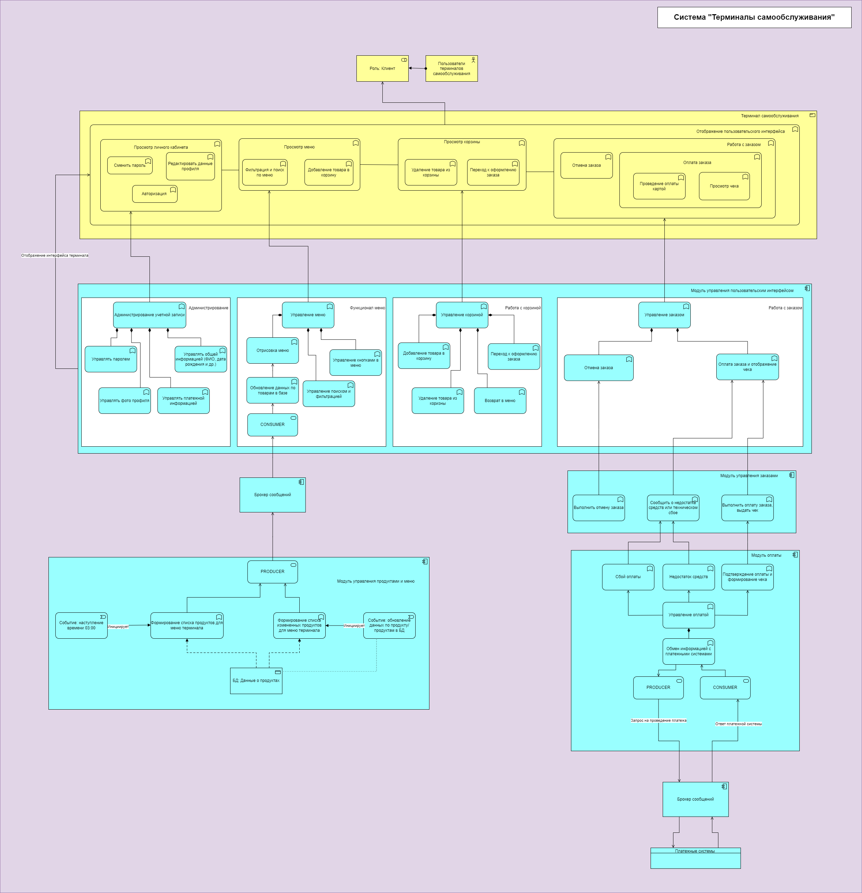

= Проект по доработке процесса внедрения новых блюд для сети закусочных «Замысловатость»

== Общая информация
Текущий процесс внедрения новых блюд в сети закусочных «Замысловатость» организован крайне сложно:
Многим сотрудникам сети в целях внедрения нового продукта приходится взаимодействовать лично, что замедляет процесс принятия решения . Тратится огромное количество времени на внедрение нового блюда (более 1 месяца, за это время конкуренты успевают внедрить по 6-7 новых блюд). Артефакты их диалогов и результатов работы постоянно теряются. 
 

== Цели внедрения проекта

//Пример нумерованного списка:

. Перевод всего взаимодействия сотрудников в электронный формат (телефоны, планшеты, спец. устройства)
. Интеграция между существующими частями системы, для достижения высокой скорости внедрения новых блюд
. Доработка существующей системы взаимодействия персонала различных подразделений, с учетом новых требований, или (если это будет более рентабельно) разработка отдельного функционала, который будет предназначен для внедрения новых блюд
. Изменение (при необходимости) дизайна существующих интерфейсов, для улучшения юзабилити

== Описание проекта
*Как мы будем перерабатывать и улучшать процесс:*

. Проводим оценку текущего взаимодействия всех участников процесса между собой (проведение интервью со всеми заинтересованными лицами)
. Выполняем анализ для выявления мест, в которых можно улучшить взаимодействие между пользователями, перевести все максимально в цифровой вид (то есть не распечатывать на бумаге, а отправлять через приложение/веб ресурс)
. Выполняем анализ по интеграции всех систем между собой, чтобы при вводе нового продукта не нужно было задействовать бизнес анализ, системный анализ, разработку и прочее. Как пример, технолог (или иные лица) в ходе взаимодействия с системой на своих электронных устройствах вносят изменения (добавляют товары, цены, данные по логистике и прочему), эти данные переходят из системы в систему, и в конечном итоге ответственному лицу остается лишь нажать несколько кнопок, чтобы все изменения попали туда, куда нужно.
. Делаем дизайн интерфейсов, в соответствии с анализом 
. Выполняем разработку бэкенда (начинаем сразу после анализа)
. Выполняем разработку фронта (начинаем после завершения дизайна)
. Выполняем тестирование
. Проводим внедрение
. Радуемся тому, что все работает

*Какая методология разработки выбрана и почему*

Было принято решение использовать гибкую методологию SCRUM (1 мес.  спринты), этому есть ряд причин:

. Данная методология позволяет делать быстрые и эффективные доработки продукта, что нам и надо, так как для нашей компании очень важно как можно скорее внедрить доработку. Компания трансгалактическая, соответственно каждый день промедления стоит нам существенных денежных потерь, нужно все сделать как можно скорее
. У нас небольшая команда (всего 10 человек + 1 Team Lead), поэтому эта методология нам отлично подходит. 
. Команда у нас уже опытная, все сотрудники работают более 3-х лет. Кроме этого, наша команда уже 2 года работает именно по SCRUM и успешно решает поставленные перед ней задачи. Думаю, что и эта задача не станет для нас проблемой.

*Какие ритуалы будем использовать*

Мы решили, что оставим Daily Scrum meeting , длительность 30 минут (но можем закончить и раньше, если не будет критики) и Sprint Retrospective. Решено отказаться от Sprint Planning meeting (так как спринты уже запланированы, с командой было проведено несколько встреч, на которых состав этих спринтов уже был утвержден). Также решено отказаться от Sprint Review, так как, по моему мнению, эта встреча будет лишней. Все основные доработки для улучшения процесса будут проводится на части бэка, и только небольшая часть – изменения в интерфейсе. Для согласования интерфейсов с пользователями запланированы отдельные встречи и дизайнером. Также перед внедрением будет большая встреча (около 2 часов) с заказчиками, для демонстрации итогового продукта и ответов на вопросы.

Все задачи проекта можно посмотреть по https://kirichenko-dimitrii.atlassian.net/jira/software/projects/ZAMISL/boards/1/backlog?selectedIssue=ZAMISL-81&atlOrigin=eyJpIjoiN2EzNTRkMDI4ZGM0NDA2OTk2YmU4ODQwMzk2NTZhMjYiLCJwIjoiaiJ9[ссылке] 

//формат для вставки гиперссылки link

== Roadmap проекта
1.	Спринт 1

a.	Период: 01.05.2024 – 31.05.2024
b.	Основная цель:  Анализ функционала и дизайн интерфейсов, начало разработки
c.	Количество задач: 31 шт.

2.	Спринт 2 

a.	Период: 03.06.2024 – 28.06.2024
b.	Основная цель: Завершение анализа, завершение основной части дизайна, начало активной разработки и тестирования, внедрение некоторых готовых задач
c.	Количество задач: 41 шт.

3.	Спринт 3

a.	Период: 01.07.2024 – 01.08.2024
b.	Основная цель: Завершение разработки и тестирование, завершение внедрения
c.	Количество задач: 29 шт.

Итого, старт проекта запланирован на 1.05 2024 (начало анализа, проведение интервью), завершение проекта (выпуск улучшенного процесса в промышленную эксплуатацию) запланирован на 02.08.2024. Таким образом, доработка займет примерно 3 полных месяца.

Диаграмму Ганта можно посмотреть в JIRA, пункт «Хронология» в проекте

== Команда проекта

.Команда проекта
[cols="2*", options="header"]  
|=== 
|Должность|Количество
|Team Lead системных аналитиков|1
|Системный аналитик|3
|Дизайнер|1
|BE Разработчик|2
|FE Разработчик|2
|Тестировщик|2
|===

== Риски проекта

*Детализация рисков*

*Разбор основного риска*

== Описание выбранного решения

Архитектура системы Терминалов самообслуживания доступна по link:diagrams\Arcitect_terminal.drawio[ссылке]. Файл необходимо скачать и открыть на сайте https://app.diagrams.net/ 

Для реализации данной системы (да и в целом всех систем закусочной) на мой взгляд идеально подходит архитектура SOA + EDA.
На приложенной схеме я выделил несколько модулей, каждый из которых выполняет свою функцию. 
Основой всего служит модуль управления пользовательским интерфейсом. В этом модуле я выделил несколько частей, каждая из которых отвечает за свой функционал терминала: 

* Администрирование (Авторизация в терминале, смена пароля, смена фото и редактирование других данных)
* Функционал меню (Отрисовка меню, Управление поиском и фильтрацией, Управление кнопками, Обновление данных по товарам в базе)
* Работа с корзиной (Добавление в корзину, Удаление из корзины, Возврат в меню и Переход к оформлению заказа)
* Работа с заказом (Отмена заказа, Оплата заказа и отображение чека)

Чтобы функционал меню мог отображать актуальные товары, у него существует функционал обновления данных по товарам в БД. Тут у нас подключается модуль управления продуктами и меню. В этом модуле существует два вида функционала:

* Формирование списка продуктов для меню раз в сутки (инициируется событием «наступление времени 03:00»)
* Формирование списка измененных продуктов (инициируется событием «обновление продукта/продуктов в БД»)

После формирования списка, неважно через какой функционал это произошло, он выгружается в сервис PRODUCER, затем попадает в брокер сообщений, а из него вычитывается сервисом CONSUMER, который находится в модуле управления пользовательским интерфейсом . Таким образом меню на терминале остается всегда в актуальном состоянии.
Для работы с заказом (когда клиент уже прошел через корзину и подтвердил заказ) подключается модуль управления заказами. В нем я выделил три функциональности:

* Выполнение отмены заказа
* Сообщить о недостатке средств или техническом сбое
* Выполнить оплату заказу и выдать чек

Модуль управления заказами не может полноценно работать без проведения оплаты. Для этого он интегрирован с модулем оплаты, в частности функционал «Сообщить о недостатке средств или техническом сбое» и «Выполнить оплату заказу и выдать чек» получает данные из этого модуля.
В модуле оплаты основной функционал это «Управление оплатой». Он имеет интеграцию с платежными системами, причем в обе стороны. То есть он может как посылать запросы на оплату в эти системы (Схема «Управление оплатой» --> «Обмен информацией с платежными системами» --> PRODUCER --> Брокер сообщений --> Платежные системы ), так и получать информацию из этих систем (Схема «Платежные системы --> Брокер сообщений --> CONSUMER --> «Обмен информацией с платежными системами» --> «Управление оплатой» )

Ответ от платежной системы может быть трех видов: Успешная оплата, Неуспешная оплата (не хватает средств), Сбой оплаты (неизвестная причина). В зависимости от ответа платежной системы, модуль оплаты инициирует различный функционал, и после передает информацию в модуль управления заказами

== Описание архитектуры с НФТ

Посмотреть полную схему архитектуры системы вместе с интеграцией системы внедрения новых продуктов, а также с учетом некоторых критичных НФТ можно по link:diagrams\Architect+NFT+new_module.drawio[ссылке]. Файл необходимо скачать и открыть на сайте https://app.diagrams.net/ 

image::images/Архитектура системы + интеграция системы внедрения новых продуктов + НФТ .png[Архитектура системы, интергация нового модуля и НФТ]

По итогам проведенной АТАМ сессии были выявлены НФТ, которые требуется учесть при проектировании архитектуры системы.
Ряд требований, таких как Масштабируемость и Производительность системы будут реализованы без изменения существующей архитектуры. Так как решение является облачным, то при необходимости мы можем либо докупить у провайдера новые сервера (Масштабируемость), либо увеличить мощность процессоров или количество оперативной памяти (Производительность). Все это делается в пару кликов в интерфейсе управления облачным решением.
Для требований по Безопасности и по Надежности потребовалось изменение существующей архитектуры.
В схеме существующей архитектуры новые элементы (которые относятся к НФТ) специально изображены на на розовых подложках, чтобы было проще их найти.
Для реализации требований по надежности будет выполнена репликация базы, при этом будут выполняться бэкапы данных раз в сутки (ночью), чтобы избежать нагрузки на БД. При такой схеме, даже если что-то случится с основной БД, у нас всегда будет резервная, в крайнем случае с данными свежестью на прошлый день.
Для реализации требований по безопасности в архитектуру были внесены значительные изменения. Основным требованием по безопасности, которое мы пытались учесть, была двухфакторная аутентификация. Как отмечали заинтересованные лица, это очень важная вещь, так как злоумышленники часто крадут аккаунты пользователей, в связи с чем те теряют доступ к заказам, а также (что самое важное) к средствам на аккаунте, к бонусам и прочему.
Для решения этой задачи, было сделано следующее:

. Выделена новая система «Двухфакторная аутентификация», в которой будет два модуля – модуль отправки сообщений на телефон и модуль генерации кодов
. В системе «Терминалы самообслуживания» выделен отдельный модуль авторизации, который будет отправлять запросы в систему двухфакторной аутентификации и принимать от нее ответы. Также этот модуль будет выполнять непосредственно авторизацию, если код совпал с кодом системы.
. Расширен модуль управления интерфейсом пользователя в системе «Терминалы самообслуживания», теперь там появилась часть, которая управляет формами для авторизации
. Выделены новые очереди в брокере сообщений, через которые происходит обмен данными между новой системой и новым модулем

.Нефункциональные требования
[options="header"]
|===
|Сценарий |НФТ | Приоритет
|Быстрое восстановление после отключения электричества |Надежность | Средний
|Восстановление данных после случайного удаления (по любой причине) |Надежность | Высокий
|Стабильная работа при подключении к сети дополнительно 500 торговых точек за год |Масштабируемость | Средний
|Стабильная работа при подключении к существующей сети информационных систем других сетей (при поглощении) |Масштабируемость | Средний
|Сохранение производительности при росте среднего количества заказов в час ( +1000) в течение года (сейчас 5000 в час, будет 6000 в час к концу года) |Производительность | Высокий
|Сохранение производительности при пиковых нагрузках на систему (в пятницу и субботу с 16 до 19 ). Количество заказов в час рост + 50% |Производительность | Высокий
|Устойчивость сети при DDOS атаке и/или быстрое восстановление после такой атаки |Безопасность | Низкий
|Сохранение аккаунта пользователя при попытке его кражи (при помощи двухфакторной аутентификации) |Безопасность | Низкий
|===

== Заключение

Реализация этого проекта позволит многократно сократить время на внедрение новых продуктов сети наших закусочных, что положительно скажется на уровне лояльности наших клиентов, а так же повысит уровень нашей конкурентоспособности, что в итоге приведет к росту выручки.